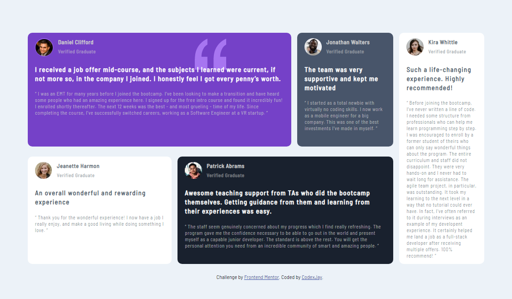

# Frontend Mentor - Testimonials grid section solution

This is a solution to the [Testimonials grid section challenge on Frontend Mentor](https://www.frontendmentor.io/challenges/testimonials-grid-section-Nnw6J7Un7). Frontend Mentor challenges help you improve your coding skills by building realistic projects. 

## Table of contents

- [Overview](#overview)
  - [The challenge](#the-challenge)
  - [Screenshot](#screenshot)
  - [Links](#links)
- [My process](#my-process)
  - [Built with](#built-with)
  - [What I learned](#what-i-learned)
  - [Continued development](#continued-development)
  - [Useful resources](#useful-resources)
- [Author](#author)
- [Acknowledgments](#acknowledgments)

**Note: Delete this note and update the table of contents based on what sections you keep.**

## Overview

### The challenge

Users should be able to:

- View the optimal layout for the site depending on their device's screen size

### Screenshot




### Links

- Solution URL: [Add solution URL here](https://your-solution-url.com)
- Live Site URL: [Add live site URL here](https://your-live-site-url.com)

## My process

### Built with

- Semantic HTML5 markup
- CSS custom properties
- CSS Grid
- Mobile-first workflow


### What I learned

I learnt how to really use the grid display property

To see how you can add code snippets, see below:

```html
<main>Some HTML code I'm proud of</main>
```
```css
#one{grid-area: header;}
    #two{grid-area: center;}
    #three{grid-area: left;}
    #four{grid-area: footer;}
    #five{grid-area: right;}

    main{
        display: grid;
        grid-template-areas: 
        'header header header header header center center right'
        'header header header header header center center right'
        'left footer footer footer footer footer footer right'
        'left footer footer footer footer footer footer right'
        ;
        grid-gap: 0 20px;
        width: 95%;
        margin:  auto ;
        padding: 50px 0;
        height: 100px;
    }
```
```js
const proudOfThisFunc = () => {
  console.log('🎉')
}
```

### Continued development

Area of Focus
*perfecting my use of grid and other layout and how to manipulate them

### Useful resources

- [ resource 1](https://www.w3schools.com/css/css_grid.asp) - This helped me in using the grid layout. I really liked this pattern and will use it going forward.

## Author

- Website - [Add your name here](https://www.your-site.com)
- Frontend Mentor - [@Jay035](https://www.frontendmentor.io/profile/Jay035)
- Twitter - [@Chibuike035](https://mobile.twitter.com/Chibuike035)


